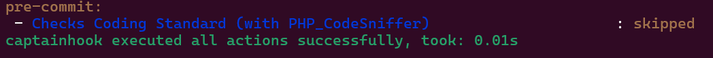
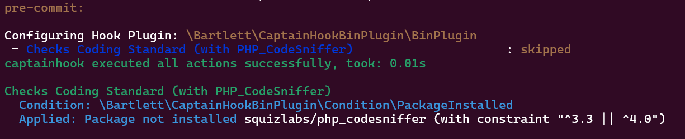
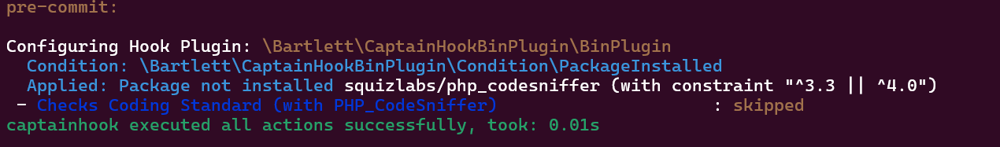

<!-- markdownlint-disable MD013 -->
# About this project

This package provides an action for [CaptainHook][captainhook]
which will invoke any binary dependencies if (and only if) packages are installed.

I recommend to install your dependencies with the [Composer Bin Plugin][bamarni-bin] to avoid conflicts.
On my own opinion it's a better strategy than using the `require-dev` entry of your `composer.json` config file that install all dependencies without control and/or filter possibilities.

If you follow this recommendation, I suggest to configure it correctly in your `composer.json`

```json
{
    "extra": {
        "bamarni-bin": {
            "bin-links": true,
            "forward-command": false,
            "target-directory": "vendor-bin"
        }
    }
}
```

> [!IMPORTANT]
> The `forward-command` set to false allow to install only dependencies that you want by manually run `composer bin <namespace> update`
> Otherwise, it will act as the `require-dev` Composer strategy, and install all dependencies at once.

And use a CaptainHook bootstrapping option with file such as the [vendor bin autoloader](https://github.com/llaville/captainhook-bin-plugin/blob/main/examples/vendor-bin-autoloader.php) example
that register only additional autoloader of your dependencies handled by the Composer Bin Plugin.

## Goals

This CaptainHook Plugin avoid situation where you run a binary dependency action and got a failure because the binary is not available (package not installed).

It provides :

1. A [Condition](https://github.com/llaville/captainhook-bin-plugin/blob/main/src/Condition/PackageInstalled.php) that check if package you want to use is installed or not (optional usage).
2. A [Plugin](https://github.com/llaville/captainhook-bin-plugin/blob/main/src/BinPlugin.php) that configure the runtime environment for running `action` in optimized way
3. Act as CaptainHook [SimplePlugin][captainhook-simple-plugin] with an improved presentation for debugging purpose.
4. Possibilities to avoid hard-coding values on `action` command line. All flags should be resolved at CaptainHook runtime.

## Features

- Execute any of your favorite PHP toolchain via the Command Line Interface, only if available
- Skip vendor action execution, if the dependency is not installed or does not satisfy minimum requirement of your platform
- Automatic Condition applied if not specified in your `captainhook.json` configuration.

## Installation

Install this package as a development dependency using [Composer][composer]:

```shell
composer require --dev bartlett/captainhook-bin-plugin
```

> [!NOTE]
>
> This project provides some additional PHP toolchain that you can install (for demo purpose)
> with [Composer-Bin-Plugin][bamarni-bin] to isolate your binary dependencies.

## Usage

Add the following and minimal code to your `captainhook.json` configuration file:

```json
{
    "config": {
        "plugins": [
            {
                "plugin": "\\Bartlett\\CaptainHookBinPlugin\\BinPlugin"
            }
        ]
    }
}
```

## Conditional usage

If you want to perform your Action only when your dependency is installed, you have two strategies available :

1. the standard CaptainHook way with [`conditions`][captainhook-conditions]
2. the plugin options via the `package-require` configuration property.

### Standard CaptainHook Conditions

You can add a corresponding condition to the action:

For example, if you want to run action for at least PHP Code Sniffer 3.3 or greater :

```json
{
    "pre-commit": {
        "enabled": true,
        "actions": [
            {
                "action": "vendor/bin/phpcs",
                "config": {
                    "label": "Static Analysis (with PHP Code Sniffer)"
                },
                "conditions": [
                    {
                        "exec": "\\Bartlett\\CaptainHookBinPlugin\\Condition\\PackageInstalled",
                        "args": ["squizlabs/php_codesniffer", "^3.3 || ^4.0"]
                    }
                ]
            }
        ]
    }
}
```

> [!NOTE]
> On Condition arguments :
> - the first entry is the Composer package name,
> - the second entry is the version constraint (same syntax as Composer Semver), with default value to '*' means no constraint.

Try it with following command :

```shell
vendor/bin/captainhook hook:pre-commit --configuration captainhook.json.sample1
```

That prints something like



Know more when verbose mode is enabled (level 1)



### Plugin Configuration

You can add a corresponding condition to the action:

For example, if you want to run action for at least PHP Code Sniffer 3.3 or greater :

```json
{
    "pre-commit": {
        "enabled": true,
        "actions": [
            {
                "action": "vendor/bin/phpcs",
                "config": {
                    "label": "Static Analysis (with PHP Code Sniffer)"
                },
                "options": {
                    "package-require": [
                        "squizlabs/php_codesniffer",
                        "^3.3 || ^4.0"
                    ]
                }
            }
        ]
    }
}
```

Try it with following command :

```shell
vendor/bin/captainhook hook:pre-commit --configuration captainhook.json.sample2 --verbose
```

That prints something like



## Configuration

### Configuration Properties

Configuration for `bartlett/captainhook-bin-plugin` consists of the following properties:

| Property             | Description                                                                                          |
|----------------------|------------------------------------------------------------------------------------------------------|
| `package-require`    | The package name (Composer Identifier) and optionally a version constraint (Composer Semver syntax)  |
| `config-directory`   | The Configuration directory where to find your binary dependency config file                         |
| `config-file`        | Your binary dependency configuration filename                                                        |
| `binary-directory`   | Your binary dependency lookup directory (see https://getcomposer.org/doc/06-config.md#bin-dir)       |
| `dependency-manager` | Your dependency manager : `Composer` (default), `Phive` (alternative) ... or your own implementation |

Please read the full documentation of Captain Hook that can be found at [php.captainhook.info][captainhook-docs].

## Learn by example

On official documentation, you can find [many examples](docs/learn/README.md) that demonstrate features of this plugin.

With `captainhook.json.sample` config file, you can quickly see all plugin options defined with a `pre-push` hook
running the [Mago][mago] PHP toolchain.

This is an efficient example that show (if binary dependency support it), how to run the same CaptainHook config file
without to change its contents, and override only Environment Variables.

First try with :

```shell
vendor/bin/captainhook hook:pre-push -c captainhook.json.sample --verbose
```

Results by [image](docs/assets/images/mago-sample-auto-colors.png)

Second try with :

```shell
FORCE_COLOR=1 vendor/bin/captainhook hook:pre-push -c captainhook.json.sample --verbose
```

Results by [image](docs/assets/images/mago-sample-force-color.png)

## Documentation

Full documentation may be found in [`docs`](docs/README.md) folder into this repository, and may be read online without to do anything else.

As alternative, you may generate a professional static site with [Material for MkDocs][mkdocs-material].

Configuration file `mkdocs.yml` is available and if you have Docker support,
the documentation site can be simply build with following command:

```shell
docker run --rm -it -u "$(id -u):$(id -g)" -v ${PWD}:/docs squidfunk/mkdocs-material build --verbose
```

## Credits

Inspired by [`moxio/captainhook-eslint`][captainhook-eslint], a Captain Hook Plugin,
that validate files using ESLint only if it installed on your platform.

[bamarni-bin]: https://github.com/bamarni/composer-bin-plugin
[captainhook]: https://github.com/captainhook-git/captainhook
[captainhook-simple-plugin]: https://github.com/captainhook-git/captainhook/blob/main/src/Plugin/Hook/SimplePlugin.php
[captainhook-docs]: https://php.captainhook.info/
[captainhook-conditions]: https://php.captainhook.info/conditions.html
[captainhook-eslint]: https://github.com/Moxio/captainhook-eslint
[composer]: https://getcomposer.org
[keep-a-changelog]: https://keepachangelog.com/en/1.1.0/
[mago]: https://github.com/carthage-software/mago
[mkdocs-material]: https://github.com/squidfunk/mkdocs-material
[xdg-base-dirs-spec]: https://specifications.freedesktop.org/basedir/latest/
