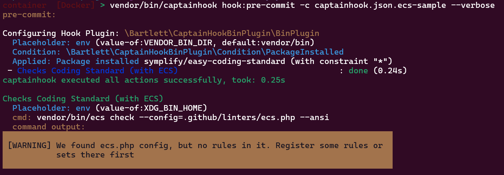

<!-- markdownlint-disable MD013 -->
# Easy-Coding-Standard aka ECS

:material-web: Visit [Official Project Site](https://github.com/easy-coding-standard/easy-coding-standard)

## Goals

See how to use the `binary-directory` option and/or `XDG_BIN_HOME` environment variable.

## Installation

=== ":octicons-command-palette-16: Install Command"

    ```shell
    composer bin ecs update
    ```

=== ":material-text-long: Standard Output"

    > [!NOTE]
    >
    > Generated with Composer 2.9 (and composer-bin-plugin 1.9) on PHP 8.2 runtime

    ```text
    [bamarni-bin] Checking namespace vendor-bin/ecs
    Loading composer repositories with package information
    Updating dependencies
    Lock file operations: 1 install, 0 updates, 0 removals
      - Locking symplify/easy-coding-standard (13.0.4)
    Writing lock file
    Installing dependencies from lock file (including require-dev)
    Package operations: 1 install, 0 updates, 0 removals
      - Downloading symplify/easy-coding-standard (13.0.4)
      - Installing symplify/easy-coding-standard (13.0.4): Extracting archive
    Generating autoload files
    1 package you are using is looking for funding.
    Use the `composer fund` command to find out more!
    No security vulnerability advisories found.
    ```

## Run sample

=== ":octicons-command-palette-16: Test Hook"

    ```shell
    vendor/bin/captainhook hook:pre-commit -c captainhook.json.ecs-sample --verbose
    ```

=== ":octicons-file-code-16: Configuration File"

    ```json hl_lines="13 22"
    {
        "config": {
            "allow-failure": false,
            "bootstrap": "examples/vendor-bin-autoloader.php",
            "ansi-colors": true,
            "git-directory": ".git",
            "fail-on-first-error": false,
            "verbosity": "normal",
            "plugins": [
                {
                    "plugin": "\\Bartlett\\CaptainHookBinPlugin\\BinPlugin",
                    "options": {
                        "binary-directory": "{$ENV|value-of:VENDOR_BIN_DIR|default:vendor/bin}"
                    }
                }
            ]
        },
        "pre-commit": {
            "enabled": true,
            "actions": [
                {
                    "action": "{$ENV|value-of:XDG_BIN_HOME}ecs check --config=.github/linters/ecs.php --ansi",
                    "config": {
                        "label": "Checks Coding Standard (with ECS)"
                    },
                    "options": {
                        "package-require": [
                            "symplify/easy-coding-standard"
                        ]
                    }
                }
            ]
        }
    }
    ```

    > [!NOTE]
    > Explains about the `captainhook.json.ecs-sample` config file
    >
    > The `{$ENV|value-of:XDG_BIN_HOME}` syntax allow to lookup directory where to find binary vendor:
    >
    > 1. by the `binary-directory` option definition
    > 2. allow overrides look up directory by the `XDG_BIN_HOME` env var

=== ":material-text-long: Results"

    
