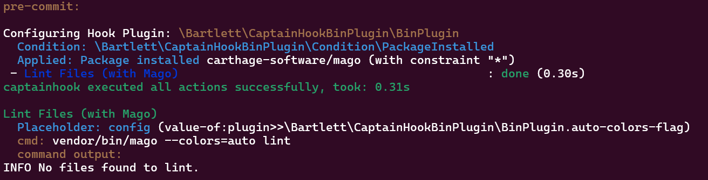
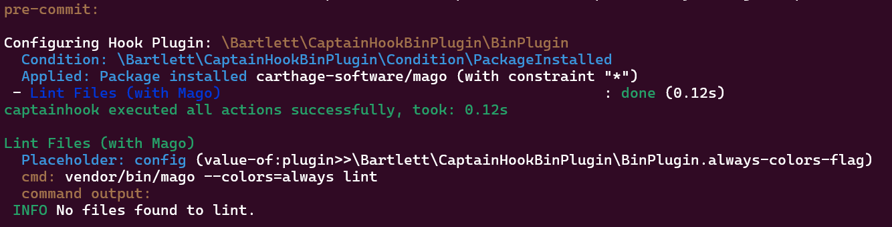

<!-- markdownlint-disable MD013 -->
# Mago

:material-web: Visit [Official Project Site](https://github.com/carthage-software/mago)

## Goals

See how to use the `auto-colors-flag`, `always-colors-flag` or `never-colors-flag` options.

## Installation

=== ":octicons-command-palette-16: Install Command"

    ```shell
    composer bin mago update
    ```

=== ":material-text-long: Standard Output"

    > [!NOTE]
    >
    > Generated with Composer 2.9 (and composer-bin-plugin 1.9) on PHP 8.2 runtime

	```text
	[bamarni-bin] Checking namespace vendor-bin/mago
	Loading composer repositories with package information
	Updating dependencies
	Lock file operations: 1 install, 0 updates, 0 removals
	  - Locking carthage-software/mago (1.13.3)
	Writing lock file
	Installing dependencies from lock file (including require-dev)
	Package operations: 1 install, 0 updates, 0 removals
	  - Downloading carthage-software/mago (1.13.3)
	  - Installing carthage-software/mago (1.13.3): Extracting archive
		Skipped installation of bin composer/bin/mago for package carthage-software/mago: name conflicts with an existing file
	Generating autoload files
	1 package you are using is looking for funding.
	Use the `composer fund` command to find out more!
	No security vulnerability advisories found.
	```

## Run sample

=== ":octicons-command-palette-16: Test Hook"

    ```shell
    vendor/bin/captainhook hook:pre-commit -c captainhook.json.mago-sample --verbose
    ```

=== ":octicons-file-code-16: Configuration File"

	```json hl_lines="13-15 24"
	{
		"config": {
			"allow-failure": false,
			"bootstrap": "examples/vendor-bin-autoloader.php",
			"ansi-colors": true,
			"git-directory": ".git",
			"fail-on-first-error": false,
			"verbosity": "normal",
			"plugins": [
				{
					"plugin": "\\Bartlett\\CaptainHookBinPlugin\\BinPlugin",
					"options": {
						"auto-colors-flag": "--colors=auto",
						"always-colors-flag": "--colors=always",
						"never-colors-flag": "--colors=never"
					}
				}
			]
		},
		"pre-commit": {
			"enabled": true,
			"actions": [
				{
					"action": "vendor/bin/mago {$CONFIG|value-of:plugin>>\\Bartlett\\CaptainHookBinPlugin\\BinPlugin.always-colors-flag} lint",
					"config": {
						"label": "Lint Files (with Mago)"
					},
					"options": {
						"package-require": [
							"carthage-software/mago"
						]
					}
				}
			]
		}
	}
	```

    > [!NOTE]
    > Explains about the `captainhook.json.mago-sample` config file
    >
    > The `{$CONFIG|value-of:plugin>>\\Bartlett\\CaptainHookBinPlugin\\BinPlugin.always-colors-flag}` syntax allow to access the plugin config for `always-colors-flag`:
    >
    > - the `auto-colors-flag` option definition is `--colors=auto` (this is option used by Mago but also PHPUnit)
    > - the `always-colors-flag` option definition is `--colors=always` (this is option used by Mago but also PHPUnit)

    > [!IMPORTANT]
    >
    > 1. As CaptainHook does not (yet) delegate the color support (even if `ansi-colors` is set to TRUE), we must tell it on each binary dependency action.
    > 2. Refer to each dependency binary documentation to know what flag is accepted.


=== ":material-text-long: Results"

    As we have seen with PHPLint example, the color support is not propagated to each binary dependency action.

    

    So we should specify it explicitly

    
