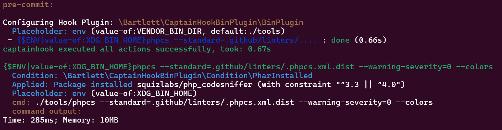

<!-- markdownlint-disable MD013 -->
# PHP_CodeSniffer aka PHPCS

:material-web: Visit [Official Project Site](https://github.com/PHPCSStandards/PHP_CodeSniffer)

## Goals

See how to use the plugin with PHAR tools in [PHIVE](https://github.com/phar-io/phive) context.

## Installation

=== ":octicons-command-palette-16: Install Command"

    ```shell
    phive install phpcs@^4.0
    ```

=== ":material-text-long: Standard Output"

    > [!NOTE]
    >
    > Generated with Phive 0.16 on PHP 8.1 runtime

    ```text
    Phive 0.16.0 - Copyright (C) 2015-2026 by Arne Blankerts, Sebastian Heuer and Contributors
    Fetching repository list
    Downloading https://phar.io/data/repositories.xml
    Downloading https://phars.phpcodesniffer.com/phars/phive.xml
    Downloading https://phars.phpcodesniffer.com/phars/phpcs-4.0.1.phar
    Downloading https://phars.phpcodesniffer.com/phars/phpcs-4.0.1.phar.asc
    Downloading key 97B02DD8E5071466
    Trying to connect to keys.openpgp.org (195.201.47.43)
    Downloading https://keys.openpgp.org/pks/lookup?op=get&options=mr&search=0x97B02DD8E5071466
    Successfully downloaded key.

            Fingerprint: D91D 8696 3AF3 A29B 6520 4622 97B0 2DD8 E507 1466

            Juliette Reinders Folmer (Release key for PHPCS) <juliette@phpcodesniffer.com>

            Created: 2025-06-12

    Import this key? [y|N] y
    Linking /home/devilbox/.phive/phars/phpcs-4.0.1.phar to /shared/backups/bartlett/captainhook-bin-plugin/tools/phpcs
    ```

## Run sample

=== ":octicons-command-palette-16: Test Hook"

    ```shell
    vendor/bin/captainhook hook:pre-commit -c captainhook.json.phpcs-sample --verbose
    ```

=== ":octicons-file-code-16: Configuration File"

    ```json hl_lines="13 14 23"
    {
        "config": {
            "allow-failure": false,
            "bootstrap": "examples/vendor-bin-autoloader.php",
            "ansi-colors": true,
            "git-directory": ".git",
            "fail-on-first-error": false,
            "verbosity": "normal",
            "plugins": [
                {
                    "plugin": "\\Bartlett\\CaptainHookBinPlugin\\BinPlugin",
                    "options": {
                        "binary-directory": "{$ENV|value-of:VENDOR_BIN_DIR|default:./tools}",
                        "dependency-manager": "phive"
                    }
                }
            ]
        },
        "pre-commit": {
            "enabled": true,
            "actions": [
                {
                    "action": "{$ENV|value-of:XDG_BIN_HOME}phpcs --standard=.github/linters/.phpcs.xml.dist --warning-severity=0 --colors",
                    "options": {
                        "package-require": [
                            "squizlabs/php_codesniffer",
                            "^3.3 || ^4.0"
                        ]
                    }
                }
            ]
        }
    }
    ```

    > [!NOTE]
    > Explains about the `captainhook.json.phpcs-sample` config file
    >
    > The `{$ENV|value-of:XDG_BIN_HOME}` syntax allow to lookup directory where to find the PHAR tools installad by Phive:
    >
    > 1. when `dependency-manager` is set to **phive**, the `binary-directory` option definition (`default` value) must specify the same target directory as Phive.
    > 2. allow overrides look up directory by the `XDG_BIN_HOME` env var

=== ":material-text-long: Results"

    
