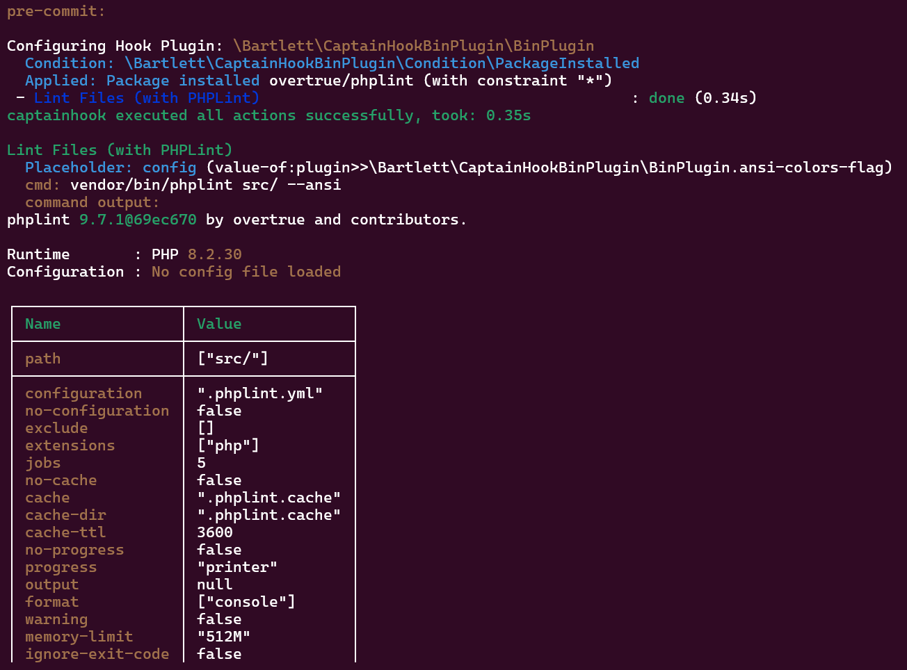

<!-- markdownlint-disable MD013 -->
# PHPLint

:material-web: Visit [Official Project Site](https://github.com/overtrue/phplint)

## Goals

See how to use the `ansi-colors-flag` option.

## Installation

=== ":octicons-command-palette-16: Install Command"

    ```shell
    composer bin phplint update
    ```

=== ":material-text-long: Standard Output"

    > [!NOTE]
    >
    > Generated with Composer 2.9 (and composer-bin-plugin 1.9) on PHP 8.2 runtime

    ```text
    [bamarni-bin] Checking namespace vendor-bin/phplint
    Loading composer repositories with package information
    Updating dependencies
    Lock file operations: 22 installs, 0 updates, 0 removals
      - Locking overtrue/phplint (9.7.1)
      - Locking psr/cache (3.0.0)
      - Locking psr/container (2.0.2)
      - Locking psr/event-dispatcher (1.0.0)
      - Locking psr/log (3.0.2)
      - Locking symfony/cache (v7.4.6)
      - Locking symfony/cache-contracts (v3.6.0)
      - Locking symfony/console (v7.4.6)
      - Locking symfony/deprecation-contracts (v3.6.0)
      - Locking symfony/event-dispatcher (v7.4.4)
      - Locking symfony/event-dispatcher-contracts (v3.6.0)
      - Locking symfony/finder (v7.4.6)
      - Locking symfony/options-resolver (v7.4.0)
      - Locking symfony/polyfill-ctype (v1.33.0)
      - Locking symfony/polyfill-intl-grapheme (v1.33.0)
      - Locking symfony/polyfill-intl-normalizer (v1.33.0)
      - Locking symfony/polyfill-mbstring (v1.33.0)
      - Locking symfony/process (v7.4.5)
      - Locking symfony/service-contracts (v3.6.1)
      - Locking symfony/string (v7.4.6)
      - Locking symfony/var-exporter (v7.4.0)
      - Locking symfony/yaml (v7.4.6)
    Writing lock file
    Installing dependencies from lock file (including require-dev)
    Package operations: 22 installs, 0 updates, 0 removals
      - Downloading symfony/polyfill-ctype (v1.33.0)
      - Downloading symfony/deprecation-contracts (v3.6.0)
      - Downloading symfony/yaml (v7.4.6)
      - Downloading symfony/process (v7.4.5)
      - Downloading symfony/options-resolver (v7.4.0)
      - Downloading symfony/finder (v7.4.6)
      - Downloading psr/event-dispatcher (1.0.0)
      - Downloading symfony/event-dispatcher-contracts (v3.6.0)
      - Downloading symfony/event-dispatcher (v7.4.4)
      - Downloading symfony/polyfill-mbstring (v1.33.0)
      - Downloading symfony/polyfill-intl-normalizer (v1.33.0)
      - Downloading symfony/polyfill-intl-grapheme (v1.33.0)
      - Downloading symfony/string (v7.4.6)
      - Downloading psr/container (2.0.2)
      - Downloading symfony/service-contracts (v3.6.1)
      - Downloading symfony/console (v7.4.6)
      - Downloading symfony/var-exporter (v7.4.0)
      - Downloading psr/cache (3.0.0)
      - Downloading symfony/cache-contracts (v3.6.0)
      - Downloading psr/log (3.0.2)
      - Downloading symfony/cache (v7.4.6)
      - Downloading overtrue/phplint (9.7.1)
      - Installing symfony/polyfill-ctype (v1.33.0): Extracting archive
      - Installing symfony/deprecation-contracts (v3.6.0): Extracting archive
      - Installing symfony/yaml (v7.4.6): Extracting archive
      - Installing symfony/process (v7.4.5): Extracting archive
      - Installing symfony/options-resolver (v7.4.0): Extracting archive
      - Installing symfony/finder (v7.4.6): Extracting archive
      - Installing psr/event-dispatcher (1.0.0): Extracting archive
      - Installing symfony/event-dispatcher-contracts (v3.6.0): Extracting archive
      - Installing symfony/event-dispatcher (v7.4.4): Extracting archive
      - Installing symfony/polyfill-mbstring (v1.33.0): Extracting archive
      - Installing symfony/polyfill-intl-normalizer (v1.33.0): Extracting archive
      - Installing symfony/polyfill-intl-grapheme (v1.33.0): Extracting archive
      - Installing symfony/string (v7.4.6): Extracting archive
      - Installing psr/container (2.0.2): Extracting archive
      - Installing symfony/service-contracts (v3.6.1): Extracting archive
      - Installing symfony/console (v7.4.6): Extracting archive
      - Installing symfony/var-exporter (v7.4.0): Extracting archive
      - Installing psr/cache (3.0.0): Extracting archive
      - Installing symfony/cache-contracts (v3.6.0): Extracting archive
      - Installing psr/log (3.0.2): Extracting archive
      - Installing symfony/cache (v7.4.6): Extracting archive
      - Installing overtrue/phplint (9.7.1): Extracting archive
    Generating autoload files
    18 packages you are using are looking for funding.
    Use the `composer fund` command to find out more!
    No security vulnerability advisories found.
    ```

## Run sample

=== ":octicons-command-palette-16: Test Hook"

    ```shell
    vendor/bin/captainhook hook:pre-commit -c captainhook.json.phplint-sample --verbose
    ```

=== ":octicons-file-code-16: Configuration File"

    ```json hl_lines="13 22"
    {
        "config": {
            "allow-failure": false,
            "bootstrap": "examples/vendor-bin-autoloader.php",
            "ansi-colors": true,
            "git-directory": ".git",
            "fail-on-first-error": false,
            "verbosity": "normal",
            "plugins": [
                {
                    "plugin": "\\Bartlett\\CaptainHookBinPlugin\\BinPlugin",
                    "options": {
                        "ansi-colors-flag": "--ansi"
                    }
                }
            ]
        },
        "pre-commit": {
            "enabled": true,
            "actions": [
                {
                    "action": "vendor/bin/phplint src/ {$CONFIG|value-of:plugin>>\\Bartlett\\CaptainHookBinPlugin\\BinPlugin.ansi-colors-flag}",
                    "config": {
                        "label": "Lint Files (with PHPLint)"
                    },
                    "options": {
                        "package-require": [
                            "overtrue/phplint"
                        ]
                    }
                }
            ]
        }
    }
    ```

    > [!NOTE]
    > Explains about the `captainhook.json.phplint-sample` config file
    >
    > The `{$CONFIG|value-of:plugin>>\\Bartlett\\CaptainHookBinPlugin\\BinPlugin.ansi-colors-flag}` syntax allow to access the plugin config for `ansi-colors-flag`:
    >
    > - the `ansi-colors-flag` option definition is `--ansi` (this is the common option on all PHP CLI tool that implement the `symfony/console` component)

    > [!IMPORTANT]
    >
    > 1. As CaptainHook does not (yet) delegate the color support (even if `ansi-colors` is set to TRUE), we must tell it on each binary dependency action.
    > 2. Refer to each dependency binary documentation to know what flag is accepted.

=== ":material-text-long: Results"

    
