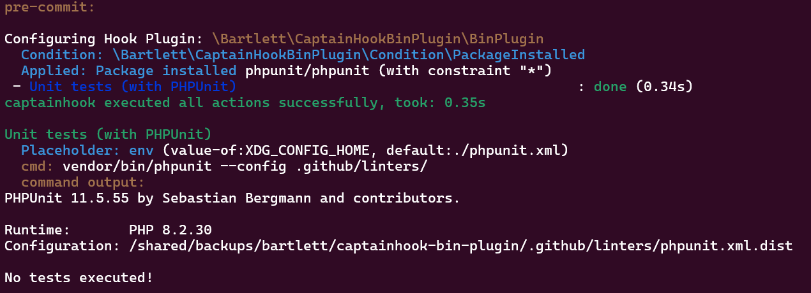

<!-- markdownlint-disable MD013 -->
# PHPUnit

:material-web: Visit [Official Project Site](https://github.com/sebastianbergmann/phpunit)

## Goals

See how to use the `config-directory`, `config-file` options and/or `XDG_CONFIG_HOME` environment variable.

## Installation

=== ":octicons-command-palette-16: Install Command"

    ```shell
    composer bin phpunit update
    ```

=== ":material-text-long: Standard Output"

    > [!NOTE]
    >
    > Generated with Composer 2.9 (and composer-bin-plugin 1.9) on PHP 8.2 runtime

    ```text
    [bamarni-bin] Checking namespace vendor-bin/phpunit
    Loading composer repositories with package information
    Updating dependencies
    Lock file operations: 27 installs, 0 updates, 0 removals
      - Locking myclabs/deep-copy (1.13.4)
      - Locking nikic/php-parser (v5.7.0)
      - Locking phar-io/manifest (2.0.4)
      - Locking phar-io/version (3.2.1)
      - Locking phpunit/php-code-coverage (11.0.12)
      - Locking phpunit/php-file-iterator (5.1.1)
      - Locking phpunit/php-invoker (5.0.1)
      - Locking phpunit/php-text-template (4.0.1)
      - Locking phpunit/php-timer (7.0.1)
      - Locking phpunit/phpunit (11.5.55)
      - Locking sebastian/cli-parser (3.0.2)
      - Locking sebastian/code-unit (3.0.3)
      - Locking sebastian/code-unit-reverse-lookup (4.0.1)
      - Locking sebastian/comparator (6.3.3)
      - Locking sebastian/complexity (4.0.1)
      - Locking sebastian/diff (6.0.2)
      - Locking sebastian/environment (7.2.1)
      - Locking sebastian/exporter (6.3.2)
      - Locking sebastian/global-state (7.0.2)
      - Locking sebastian/lines-of-code (3.0.1)
      - Locking sebastian/object-enumerator (6.0.1)
      - Locking sebastian/object-reflector (4.0.1)
      - Locking sebastian/recursion-context (6.0.3)
      - Locking sebastian/type (5.1.3)
      - Locking sebastian/version (5.0.2)
      - Locking staabm/side-effects-detector (1.0.5)
      - Locking theseer/tokenizer (1.3.1)
    Writing lock file
    Installing dependencies from lock file (including require-dev)
    Package operations: 27 installs, 0 updates, 0 removals
      - Downloading theseer/tokenizer (1.3.1)
      - Downloading nikic/php-parser (v5.7.0)
      - Downloading phar-io/version (3.2.1)
      - Downloading phar-io/manifest (2.0.4)
      - Downloading myclabs/deep-copy (1.13.4)
      - Installing staabm/side-effects-detector (1.0.5): Extracting archive
      - Installing sebastian/version (5.0.2): Extracting archive
      - Installing sebastian/type (5.1.3): Extracting archive
      - Installing sebastian/recursion-context (6.0.3): Extracting archive
      - Installing sebastian/object-reflector (4.0.1): Extracting archive
      - Installing sebastian/object-enumerator (6.0.1): Extracting archive
      - Installing sebastian/global-state (7.0.2): Extracting archive
      - Installing sebastian/exporter (6.3.2): Extracting archive
      - Installing sebastian/environment (7.2.1): Extracting archive
      - Installing sebastian/diff (6.0.2): Extracting archive
      - Installing sebastian/comparator (6.3.3): Extracting archive
      - Installing sebastian/code-unit (3.0.3): Extracting archive
      - Installing sebastian/cli-parser (3.0.2): Extracting archive
      - Installing phpunit/php-timer (7.0.1): Extracting archive
      - Installing phpunit/php-text-template (4.0.1): Extracting archive
      - Installing phpunit/php-invoker (5.0.1): Extracting archive
      - Installing phpunit/php-file-iterator (5.1.1): Extracting archive
      - Installing theseer/tokenizer (1.3.1): Extracting archive
      - Installing nikic/php-parser (v5.7.0): Extracting archive
      - Installing sebastian/lines-of-code (3.0.1): Extracting archive
      - Installing sebastian/complexity (4.0.1): Extracting archive
      - Installing sebastian/code-unit-reverse-lookup (4.0.1): Extracting archive
      - Installing phpunit/php-code-coverage (11.0.12): Extracting archive
      - Installing phar-io/version (3.2.1): Extracting archive
      - Installing phar-io/manifest (2.0.4): Extracting archive
      - Installing myclabs/deep-copy (1.13.4): Extracting archive
      - Installing phpunit/phpunit (11.5.55): Extracting archive
      0/27 [>---------------------------]   0%    Skipped installation of bin bin/php-parse for package nikic/php-parser: name conflicts with an existing file
     26/27 [==========================>-]  96%    Skipped installation of bin phpunit for package phpunit/phpunit: name conflicts with an existing file
    1 package suggestions were added by new dependencies, use `composer suggest` to see details.
    Generating autoload files
    25 packages you are using are looking for funding.
    Use the `composer fund` command to find out more!
    No security vulnerability advisories found.
    ```

## Run sample

=== ":octicons-command-palette-16: Test Hook"

    ```shell
    XDG_CONFIG_HOME=.github/linters/ vendor/bin/captainhook hook:pre-commit -c captainhook.json.phpunit-sample --verbose
    ```

=== ":octicons-file-code-16: Configuration File"

    ```json hl_lines="19 24"
    {
        "config": {
            "allow-failure": false,
            "bootstrap": "examples/vendor-bin-autoloader.php",
            "ansi-colors": true,
            "git-directory": ".git",
            "fail-on-first-error": false,
            "verbosity": "normal",
            "plugins": [
                {
                    "plugin": "\\Bartlett\\CaptainHookBinPlugin\\BinPlugin"
                }
            ]
        },
        "pre-commit": {
            "enabled": true,
            "actions": [
                {
                    "action": "vendor/bin/phpunit --config {$ENV|value-of:XDG_CONFIG_HOME|default:./phpunit.xml}",
                    "config": {
                        "label": "Unit tests (with PHPUnit)"
                    },
                    "options": {
                        "config-file": "phpunit.xml.dist",
                        "package-require": [
                            "phpunit/phpunit"
                        ]
                    }
                }
            ]
        }
    }
    ```

    > [!NOTE]
    > Explains about the `captainhook.json.phpunit-sample` config file
    >
    > The `{$ENV|value-of:XDG_CONFIG_HOME|default:./phpunit.xml}` syntax allow to select the PHPUnit config file:
    >
    > 1. by the `config-file` option (search for `phpunit.xml.dist`, default to `phpunit.xml`)
    > 2. allow overrides look up directory by the `XDG_CONFIG_HOME` env var

=== ":material-text-long: Results"

    
